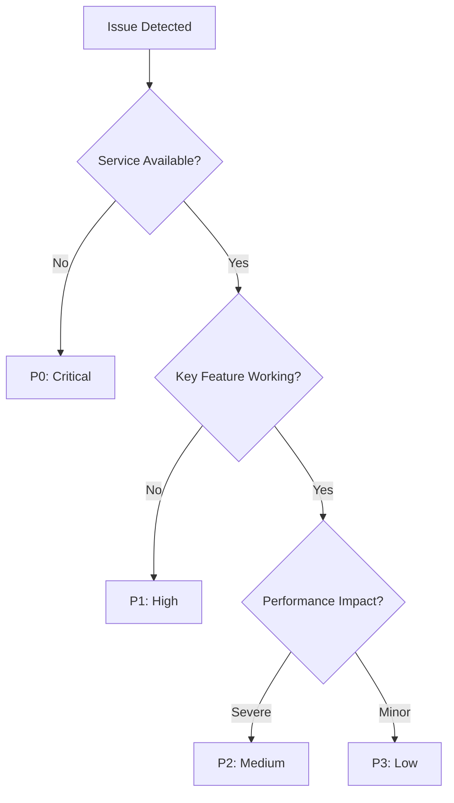

# Template: Observability and Production Monitoring

This template provides opinionated guidance for implementing comprehensive observability, monitoring, alerting, and incident response for React/Next.js/Expo/Node/Firebase applications in an Nx monorepo.

---

## Executive Summary

Implement comprehensive observability to detect, diagnose, and resolve production issues quickly. Proper monitoring, alerting, and observability are essential for maintaining application reliability and providing excellent user experience.

Fully understand [tech-stack.md](../technical/tech-stack.md) and [project-environment.md](../technical/project-environment.md) before implementing observability tools that align with the chosen technology stack.

---

## Monitoring Pillars Implementation

### Application Performance Monitoring (APM)

| Component | Tool | Purpose | Implementation |
|-----------|------|---------|----------------|
| **Web APM** | Sentry + Web Vitals | Error tracking, performance monitoring | Real User Monitoring (RUM) with Core Web Vitals tracking |
| **Mobile APM** | Firebase Performance + Crashlytics | Mobile app performance and crash reporting | Automatic trace collection, custom performance metrics |
| **API Monitoring** | DataDog APM or New Relic | Backend service monitoring | Distributed tracing, database query performance |
| **Infrastructure** | Google Cloud Monitoring | Server/container resource monitoring | CPU, memory, disk, network metrics |

**Implementation Requirements:**
- Implement real-time performance tracking for response times, throughput, and error rates
- Monitor database query performance and API endpoint latency
- Track user experience metrics (Core Web Vitals, Time to Interactive)
- Document baseline performance metrics and SLA targets

### Error Tracking and Logging

```typescript
// Sentry Configuration Example
import * as Sentry from "@sentry/nextjs";

Sentry.init({
  dsn: process.env.NEXT_PUBLIC_SENTRY_DSN,
  environment: process.env.NODE_ENV,
  tracesSampleRate: 0.1,
  profilesSampleRate: 0.1,
  beforeSend(event) {
    // Filter out sensitive information
    return event;
  },
});
```

**Structured Logging Pattern:**
```typescript
import { logger } from '@my-app/logging';

logger.info('User action completed', {
  userId: user.id,
  action: 'checkout',
  orderId: order.id,
  correlationId: req.correlationId,
  duration: Date.now() - startTime,
});
```

**Requirements:**
- Centralize error collection with context (user actions, environment, stack traces)
- Implement structured logging with correlation IDs for request tracing
- Set up log aggregation and searchability across all services
- Configure log retention policies based on compliance and debugging needs

### Infrastructure Monitoring

**Key Areas:**
- Monitor server resources (CPU, memory, disk, network) and container health
- Track database performance, connection pools, and storage utilization
- Monitor third-party service dependencies and their health status
- Implement synthetic monitoring for critical user journeys

---

## Alert Configuration Framework

### Alert Hierarchy and Escalation

| Severity | Response Time | Examples | Escalation |
|----------|---------------|----------|------------|
| **P0 - Critical** | < 15 minutes | Service completely down, data corruption | Immediate on-call notification + manager escalation |
| **P1 - High** | < 1 hour | Key feature broken, error rate > 5% | On-call notification |
| **P2 - Medium** | < 4 hours | Performance degradation, error rate > 1% | Slack notification to team |
| **P3 - Low** | < 24 hours | Minor bugs, capacity warnings | Email notification |

### Key Metrics and Thresholds

**API Health Metrics:**
```yaml
# Example alert configuration
alerts:
  api_error_rate:
    condition: error_rate > 1%
    duration: 5m
    severity: P2
  
  api_response_time:
    condition: p95_response_time > 2000ms
    duration: 10m
    severity: P2
  
  service_availability:
    condition: uptime < 99.9%
    duration: 1m
    severity: P0
```

**Frontend Performance Metrics:**
- Core Web Vitals (LCP < 2.5s, FID < 100ms, CLS < 0.1)
- JavaScript error rate < 0.1%
- Page load time p95 < 3s

**Alert Strategy Requirements:**
- Define alert severity levels (Critical, Warning, Info) with clear escalation paths
- Implement on-call rotations with primary and secondary responders
- Configure alert fatigue prevention (grouping, suppression, intelligent routing)
- Document alert response procedures and escalation timelines

---

## Incident Response Playbook

### Incident Classification



### Response Procedures

**P0/P1 Incident Response:**
1. **Immediate (0-15 min):**
   - Acknowledge alert and assess impact
   - Create incident channel (#incident-YYYY-MM-DD)
   - Notify stakeholders via status page
   - Begin diagnosis using runbooks

2. **Short-term (15-60 min):**
   - Implement immediate mitigation (rollback, feature flags)
   - Engage additional team members if needed
   - Provide regular updates every 30 minutes
   - Document timeline and actions taken

3. **Resolution (1-4 hours):**
   - Apply permanent fix
   - Verify resolution across all environments
   - Update status page and notify customers
   - Schedule post-incident review

### Post-Incident Review Template

```markdown
# Post-Incident Review: [Incident Title]

## Summary
- **Date:** YYYY-MM-DD
- **Duration:** X hours Y minutes
- **Impact:** [Customer/business impact]
- **Root Cause:** [Brief description]

## Timeline
- **HH:MM** - Issue first detected
- **HH:MM** - Incident declared
- **HH:MM** - Mitigation applied
- **HH:MM** - Full resolution

## Root Cause Analysis
[Detailed technical explanation]

## Action Items
1. [ ] Short-term fix (Owner: @person, Due: date)
2. [ ] Long-term prevention (Owner: @person, Due: date)
3. [ ] Process improvement (Owner: @person, Due: date)
```

**Framework Requirements:**
- Define incident severity levels (P0-P3) with expected response times
- Create incident response playbooks for common scenarios
- Implement incident communication protocols (status pages, stakeholder notifications)
- Establish incident commander role and responsibilities
- Conduct blameless post-mortems for all P0/P1 incidents
- Track MTTR (Mean Time to Recovery) and MTTD (Mean Time to Detection) metrics

---

## Observability Documentation Requirements

### Runbooks and Playbooks
- Create step-by-step troubleshooting guides for common issues
- Document emergency procedures (rollback, scaling, failover)
- Maintain on-call handbook with escalation contacts and procedures
- Include debugging workflows with relevant dashboards and queries

### Dashboard and Alert Maintenance
- Review and update alert thresholds quarterly based on baseline changes
- Maintain comprehensive dashboards for business metrics, system health, and user experience
- Document dashboard purposes and key metrics for different stakeholder groups
- Regularly audit and clean up unused or noisy alerts

---

## Dashboard Configuration

### Executive Dashboard
- Service uptime (monthly/quarterly)
- Customer satisfaction scores
- Support ticket volume trends
- Key business metrics alignment

### Engineering Dashboard
- Error rates by service
- Performance trends (response time, throughput)
- Deployment success rates
- Test coverage and build health

### Operations Dashboard
- Infrastructure resource utilization
- Alert noise levels and false positive rates
- MTTR/MTTD trends
- On-call workload metrics

---

## Technology Integration Examples

### Firebase + Google Cloud

```typescript
// Cloud Function monitoring
import { CloudLoggingWinston } from '@google-cloud/logging-winston';

const loggingWinston = new CloudLoggingWinston({
  projectId: process.env.GOOGLE_CLOUD_PROJECT,
  keyFilename: 'service-account-key.json',
});

logger.add(loggingWinston);
```

**Stack Integration:**
- Firebase Performance Monitoring for mobile and web apps
- Google Cloud Monitoring and Logging for infrastructure
- Firebase Crashlytics for error tracking
- Cloud Functions monitoring for serverless components

### Next.js + Vercel

```typescript
// Custom monitoring hook
export function usePerformanceMonitoring() {
  useEffect(() => {
    // Track Core Web Vitals
    getCLS(console.log);
    getFID(console.log);
    getFCP(console.log);
    getLCP(console.log);
    getTTFB(console.log);
  }, []);
}
```

### React Native + Expo

```typescript
// Expo application monitoring
import * as Sentry from 'sentry-expo';
import { Analytics } from 'expo-analytics';

Sentry.init({
  dsn: 'YOUR_DSN',
});

// Custom performance tracking
const analytics = new Analytics('tracking-id');
analytics.timing('screen_load', 'home', loadTime);
```

**Node.js/React Applications:**
- Sentry for error tracking and performance monitoring
- DataDog or New Relic for comprehensive APM
- LogRocket for session replay and user experience monitoring
- PagerDuty for incident management and on-call scheduling

---

## Enforcement and Quality Gates

### CI/CD Integration
- Block deployments if observability requirements are not met
- Require monitoring setup for new services before production deployment
- Validate alert configurations and dashboard accuracy in staging
- Include observability readiness in Definition of Done for features

### Review and Governance
- Monthly review of alert noise and false positive rates
- Quarterly assessment of monitoring coverage and blind spots
- Annual evaluation of observability tools and cost optimization
- Include observability considerations in architectural decision reviews

---

## Observability Checklist

### Pre-Production Requirements
- [ ] Error tracking configured for all applications
- [ ] Performance monitoring enabled
- [ ] Alert rules defined and tested
- [ ] Runbooks created for common scenarios
- [ ] Incident response team identified
- [ ] Status page configured

### Production Validation
- [ ] Baseline metrics established
- [ ] Alert thresholds tuned to minimize noise
- [ ] Escalation procedures tested
- [ ] Dashboard access configured for stakeholders
- [ ] Synthetic monitoring for critical paths enabled
- [ ] Log retention policies implemented

### Ongoing Maintenance
- [ ] Monthly alert review and tuning
- [ ] Quarterly dashboard effectiveness assessment
- [ ] Bi-annual incident response drill
- [ ] Annual observability stack evaluation

---

## Further Reading

- [Google SRE Handbook](https://sre.google/sre-book/) - Industry best practices
- [Datadog APM Guide](https://docs.datadoghq.com/tracing/) - Implementation details
- [Sentry Performance Monitoring](https://docs.sentry.io/performance/) - Error tracking setup
- [Firebase Performance](https://firebase.google.com/docs/perf-mon) - Mobile monitoring 